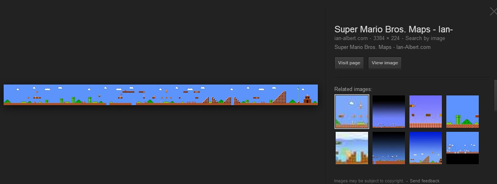

# mario! oh mario...

相信很多人的童年记忆中都有这个吃了蘑菇会变大的水管工，以及一次又一次被抓走的公主...

相信也有很多人被鬼畜喵里奥坑过。

想重温童年的快乐下午时光么？或者制造一个更鬼畜的汪里奥报复社会么？

now lets make it

## design

也许有人看到 javascript+游戏就会想到canvas，但是在canvas出现之前，也有很多使用dom实现的游戏：

 


仅使用传统技术，我们也可以完成一个好玩的游戏。那么这里我们应该采用怎样的技术呢？

canvas vs div+css(svg as the same)

|canvas|div+css|
|-------|-------|
|不具有层级关系，后画的自动覆盖先画的|based on zindex|
|每一帧都重绘，自行判断重绘范围|自动重绘|
|按像素绘图|按元素绘图|
|各种其他屌炸天高级特性|用了十几年的旧玩具|

so 我们决定使用……dom！越熟悉的越快不是么~

## develop

### map
  
首先我们需要一副地图...不会画怎么办！外事不决问谷哥内事不决戳度娘 =3=



百度的结果更直接：

[百度知道的结果](http://zhidao.baidu.com/link?url=y5ptNQz5dRD2Zg73yKIoTvr6dhWkqbQ5Tz3RMuOOZbaHoi0SEo6TtQFR1u1D2lQJV5MMj0vZyzTOaDQckZjJUK)


拿到图之后我们需要把它变成游戏的素材，也就是：切图！但是切图很麻烦呀……我们需要一个切图的工具。

#### spirit

虽然希望统统使用js搞定，但可恶的是node的图形库都需要c module支持，
而我的瘟到死系统上从来没编译成功过。
so这里我们使用python来处理(伟大的跨平台的pil)。

按grid将地图切开：

[source code : sampler.py](./demo_code/sampler.py)

切出3420个piece。

每一块都是一个元素+一个图片，这样代码和素材的体积都很庞大，我们需要优化一下。

第一步：最直观的，相同的块使用同样的图片，为了获得一个较短的唯一标识符，并且去掉文件的干扰信息，只读取图片的像素信息，并且做md5。

#### images compare

[source code : sampler_uniq_with_md5.py](./demo_code/sampler_uniq_with_md5.py)


图片资源还剩下154张，看起来不错。

对比后发现有一些非常相似的grid被判断成不一致了。理论上来说这些块都应当是一样的，只不过是因为周围元素的影响，有一些杂边。so我们需要更智能一点的比较算法。谷哥和度娘的图片搜索是怎么实现的呢？似乎可以搜到很多类似的图片嘛，lets搜一下……

著名技术科普博客主阮一峰同学恰巧做了这么一次科普：
[相似图片搜索的原理
](http://www.ruanyifeng.com/blog/2011/07/principle_of_similar_image_search.html)

我们参考这个方法升级一下去重的方法。由于这个方法无法生成一个hash，改为存储特征值。

[source code : sampler_uniq_with_compare.py](./demo_code/sampler_uniq_with_compare.py)


还剩下 114 个图片，但是我们发现仅比较直方图(histogram)，有些色彩分布相近，像素位置不同的块也被认为是一致的了，改进一下，加入位置信息：

[source code : sampler_uniq_with_compare_2x2.py](./demo_code/sampler_uniq_with_compare_2x2.py)

比较速度悲剧性的下降至25%(更快的做法？)，不过看起来是ok了。

再考虑一下这些砖块，考虑到之后做碰撞检测时如果要遍历所有的砖块将会消耗掉不必要的性能，html看起来也非常肿（其实主要原因是后一点），我们考虑将临近的类似砖块合并一下，背景就可以使用repeat了。

这里我们需要用到一点简单的2d碰撞。因为每相邻的砖块都只有边相邻，那么我们检查有没有边是重合的，就可以判定是否可以合并。由于网格比较复杂，我们参考特性，优先横向合并，再竖向合并。

[source code : sampler_uniq_with_compare_and_combine.py](./demo_code/sampler_uniq_with_compare_and_combine.py)


spirit接近完成了。但是还有一个问题，蘑菇和马里奥在地图上并不是刚好占据了一个grid，而是在多个grid中都占用了一点位置，隐藏grid也在地图上绘制出来了，纯色的背景也可以去掉。这时候没啥好办法，还是手动搞一下吧，加个配置，在合并时进行处理。

为了方便的写配置，写一个小工具来搞定这件事：

[source code : util.js](./demo_code/util.js)


这就是我们每天干的事情，非常简单但是实用。

```py
....
if __name__ == '__main__':
  unic_differ = unic_diff()
  name, piecemap = preprocess_with_uniq_test('example.gif', unic_differ.check_img)

  piecemap  = sort_then_combine(piecemap, {
                replace : {
                  '0-8'    : '',
                  '144-8'  : '',
                  '32-184' : '800-184'
                  ... 
                }
              })

  outputSource(name, piecemap)
```

完成的map


这是一种比较粗糙的处理方式，相信各位在思考后会有更好的制造地图的方法。

生成的地图数据也将被用于后续的工作。

### animate & character & player control

一个简单的做法：为每一个动画元素设置速度，然后使用计时器，计算每一个时间间隔间的移动的距离，然后更新元素的样式。当玩家按下方向键时修改速度，这样玩家就可以与游戏中的角色进行交互了。

javascript引擎并没有一个精确的时间服务，而仅有一个事件队列以及不怎么精确的setTimeout和tick。因此在既有mario又有蘑菇乌龟和金币的场景里，使用多个计时器来分别处理动画会导致各种问题，在计算碰撞时性能也会直线下降，因此我们使用一个统一的update方法和动画队列来管理所有的动画。

但这导致另一个问题，玩家的键盘操作不可能正好落到每一帧上。

我们需要将键盘事件收集起来，当每一帧被触发时，检查前一帧到这一帧之间用户进行过什么操作。

### collision

由于我们的游戏比较简单，所以我们采用比较简单的碰撞检测方法。基于以下假设：

* 所有碰撞体都是box，即是矩形的
* 所有的碰撞方式都是正交的，即是不考虑角度问题
* 所有碰撞体的相对速度都较低，即是相对速度最大值在一帧内移动的距离不超过最小碰撞体的高度/宽度
* 不考虑动力学模拟，即是不考虑质量/动能/动量等，撞上障碍物就停下来。

进阶的碰撞检测可自行探索。

碰撞检测 ： Box collision

### triggers

触发器，玩过war3的world editer的同学应该很熟悉这个玩意，即是说满足一定条件时，执行一系列任务。

由于大量触发器逻辑都是重复的，我们考虑尽可能的重用代码，建立了一个像require一样的依赖管理系统，一个触发器可以依赖其他触发器作为条件，自己也可以返回一个触发器名，调用其他的触发器。

这样做就要求每一个触发器函数都是无状态的纯函数，状态的维护就统统交给触发器事件了。

### camera

我们的地图有4000像素宽，我们的地图可能有多个场景，但玩家不可能（不应该）一次看到所有的场景，这会让游戏（制作人）失去很多乐趣。

所以我们在此引入摄影机的概念，只给玩家呈现我们希望他看到的内容。

至于如何实现…… ```.camare{ overflow : hidden; }```

### spawner

mario的敌人有许多蘑菇怪乌龟和食人花，他们不是一开始就出现在场景里的。一方面，mario刚刚问世时硬件设备还非常弱小，同时，不被呈现的角色也没有必要占据计算资源。因此我们需要在需要的时候再把他们插入到场景中。这种设备就好像玩大菠萝3里生成各色血鹰蚊子的巢穴，起个名字叫spawner(chinglish)。

触发的条件一般是两种，进入玩家视野（即是进入摄影机范围），或者希望怪物更早的开始活动，就需要一个比camare范围更大的碰撞体。

另外触发器需要维持一些状态，比如一个触发器一次同时生产多少个怪物，防止一个场景中出现过多怪物给玩家刷分或难度太高，等等。

### stages

mario有好多个关卡(7*5 or more?)，我们需要在不同的关卡间切换。考虑切换场景的问题，我们首先需要回收当前场景中的所有资源，然后将下一个场景载入进来。

- 首先停止mainloop ：clearTimeout 
- 然后切换view     ：innerHTML('new map html')
- 再切换数据       : %^%*^&^^@#!@#
- 再开始mainloop   ：%^%*^&^^@#!@#

simple and easy.当然这是建立在良好的代码习惯，数据和逻辑分离，分层解决问题的基础上的 =3=

### other things -- timers/scores/success or more

嗯 都是trigger里需要解决的问题了。